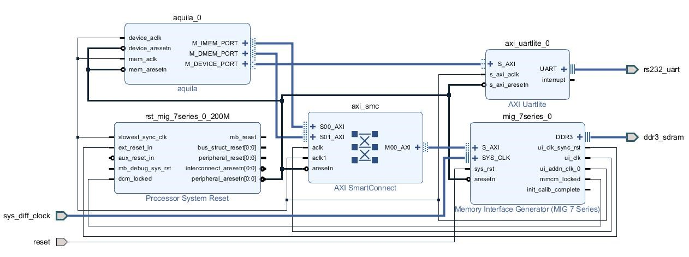

# The Aquila SoC
Aquila is an open-source 32-bit RISC-V RV32IMA compliant processor core for Xilinx FPGAs, released under the BSD-3-Clause Licence. The processor core is encapsulated as a reusable IP for Xilinx Vivado EDA tools. You can use the Vivado IP Integrator to integrate Aquila with other IPs in IP catalog to create an application-specific processor SoC.

Currently, the microarchitecture of Aquila implements the classical five-stage pipeline RISC architecture with in-order execution. Since Aquila is intended for HW-SW codesigned intelligent systems, heavy-lifting tasks will be handled by domain-specific accelerators. System-level stability and full-featured OS support will be the focus of our development for now.

Aquila is designed for intelligent system SoCs for Xilinx FPGAs. The default behavior of the Aquila SoC, when configured into a Xilinx FPGA, is to execute a boot code stored in pre-initialized on-chip memory, which load a binary executable (ELF file) from the Host PC through the UART connection. We will provide different boot ROMs in the future to boot the system from other devices (such as the SD card) to facilitate the design of a turn-key system.

# Specification
The current version of Aquila is 1.2, with the following specification:

- RV32IMA ISA-compliant.
- CSRs & related instructions for M mode.
- Embedded 64KB tightly-coupled on-chip memory (TCM).
- L1 data and instruction caches.
- CLINT for standard timer interrupts.
- The RTL model written in Verilog.
- SD card I/O support.
- Multi-threading RTOS support (FreeRTOS).
- [Networking support](https://github.com/eisl-nctu/aquila-net).
- SV32 MMU support (to be released soon).
- Full M, S, U modes support in CSRs (to be released soon).
- Multi-core support with coherent data cache controller (not in the released RTL model yet).

# Performance
On Xilinx KC-705, we synthesize the Aquila SoC @ 100MHz. Its Dhrystone number is 1.00 DMIPS/MHz and The CoreMark number is 2.07/MHz. Both benchmarks are compiled using GCC 10.2.0 and executed from the on-chip SRAM.

# Synthesis of the Aquila SoC
Aquila is developed and tested using Xilinx KC-705 development platform. Implementing an Aquila SoC would be fairly straightforward if you are familiar with the GUI IDE of Vivado. If you have to modify the boot ROM memory file, its source code and the build script is under sw/uartboot/. Please refer to the User’s Guide for more details about the Aquila SoC.

We will provide Vivado workspace for other less expensive platforms, such as the Arty A7-100, soon. However, KC-705 will be the main development platform for the Aquila SoCs.

# Simualtion of Aquila (Verilator)

Aquila provides verilator model for fast simulation and riscv-tests env for riscv-tests regression tests.

Please see tb folder for more details.

# User's Guide
A simple user's guide to Aquila is available [here](docs/aquila_manual.pdf).

# Creation of the complete Vivado workspaces of Aquila
To create the complete Vivado workspace for the Aquila SoC, you can use the hw/build.tcl script and follow the instructions [here](hw/readme.md).

We also have the tar files for previous versions of Aquila in the archive directory.
- Aquila version [0.9 preview](archive/aquila_soc_0.9_preview.tgz). Tested with Vivado 2018.2 on Xilinx KC705.

# Acknowledgment
This work is partly funded by the Taiwan Semiconductor Research Institute (TSRI), National Applied Research Laboratories (NARL), Taiwan, ROC.

# Contact Info
Embedded Intelligent Systems Lab (EISL)  
Department of Computer Science  
National Yang Ming Chiao Tung University  
Hsinchu, Taiwan

eisl.nctu-at-gmail
