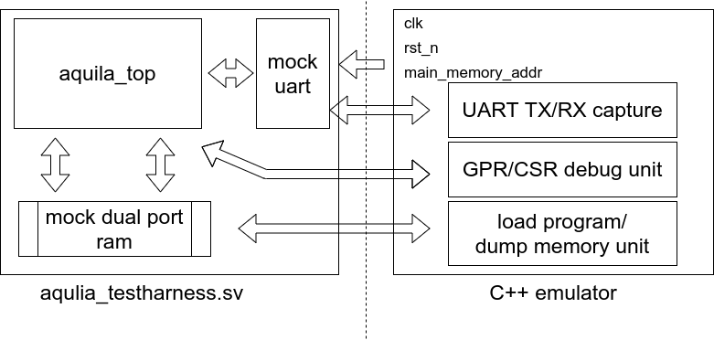

# Verilator
## folder structure
```
.
├── core-ver-src
├── full-ver-src
├── Makefile
├── riscv-isa-sim
├── tools
├── ver-test
└── ver-test-bug
```
* core-ver-src
    + aquila_top as DUT
* full-ver-src
    + deprecated
* riscv-isa-sim
    + provide fesvr/elf.h for sim_mem.cpp
    + fesvr
* tools
    + log_proccess tool
* ver-test
    + simple test program 
## usage
Go and get the [RISCV gnu toolchain](https://github.com/riscv/riscv-gnu-toolchain) and configure with soft float point support.

In *ver-test* folder,build test program by makefile,make sure that your gcc version is 8.2.0 with soft float point and rv32im support,it will create _test.o which is rv32 executable binary and test.objdump for debug purpose:
```bash
$ make all
```

In *veriate* folder,build the verilator model of Aquila by using the Makefile:
```bash
$ make core_verilate
```
To lint check only:
```bash
$ make core_lint
```
To build verilator model of Aquila library only:
```bash
$ make core_versyn
```
After `make core_verilate` or `make core_versyn` command,it will create *core_obj_dir* which contain verilator generate library and executable binary.

To run verilator model, in *core_obj_dir* execute:
```bash
$ ./Vaquila_testharness [RISCV_TEST_ELF]
```
For example:
```bash
$ ./Vaquila_testharness ../ver-test-bug/_test.o
```
It will print UART TX data to stdout, and generate aquila_core.vcd, cpu.log and dump.mem for debug.
You can use gtkwave to view waveform:
```bash
$ gtkwave aquila_core.vcd
```

To beautify cpu.log, in *tools* folder you can build and run *log_proccess* program to combine objdump file and cpu.log.
```bash
$ make log_proccess
$ ./log_proccess [OBJDUMP file] [LOG]
```
For example:
```bash
$ ./log_proccess ../ver-test-bug/test.objdump ../core_obj_dir/cpu.log
```
You can change `compress` boolean varible in log_proccess.cpp to generate cycle based log or instruction based log.
## verilator model advance usage
### Basic diagram

### code structure
* `aquila_testharness` is top module to connect `dp_ram` and`mock_uart` to `aquila_top`. 
* `aquila_core_tb.cpp` is C++ wrapper for this verilator model.
* `sim_mem.h` is header as elf file loader.
### parameter
* dp_ram.sv

| Name  | Description | limitation | default |
| -------- | -------- | -------- | ---------|
| MEM_SIZE | mock ddr main memory  size | verilator cannot synthesis large verilog array vector | 32'h200000 |
|ACCESS_LANTENCY|add latency to memory access to simulate real world scenario|bitwidth:8 bit|8'h50|
|MEM_OFFSET|memory offset,make main memory address similar to FPGA configuration|don't modify this parameter,see ip_repo/aquila/hdl/core_rtl/aquila_top.v for more information|32'h80000000|

*  mock_uart.sv

| Name  | Description | limitation | default |
| -------- | -------- | -------- | ---------|
| AXI_LANTENCY | add latency to axi slave to simulate real world scenario | bitwidth:8 bit| 8'h0A| 
|UART_TX_FIFO_DELAY|UART TX transmit delay|bitwidth:8 bit,must greater than 1|8'h01|
|UART_RXFIFO_ADDR|memory map io register address for UART_RXFIFO|don't modify|32'hC0000000|
|UART_TXFIFO_ADDR|memory map io register address for UART_TXFIFO|don't modify|32'hC0000004|
|UART_STATUS_ADDR|memory map io register address for UART_STATUS|don't modify|32'hC0000008|
## TODO
* simple dual port mcok ram for simulation
	+ load riscv-test program memory
* bootrom for simulation
    1. set the stack pointer to __stack_start ~ __stack_top
    2. jump to main
    3. jump to 0x80000000 to start program
* full system simulation
    + remove cache outward port wrapper
    + create mock ideal local memory (icache/Dcache)
    + keep S_CONFIG , DEVICE ,port

